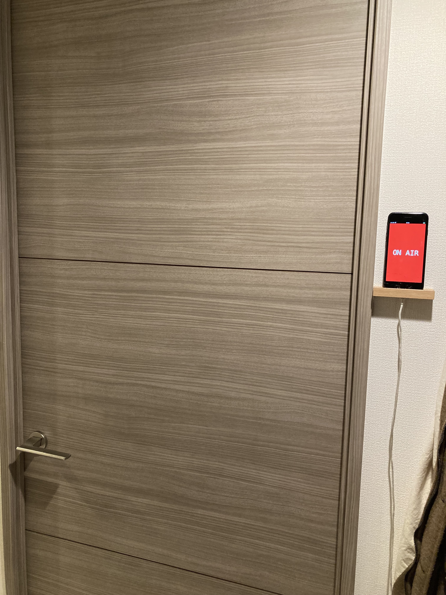
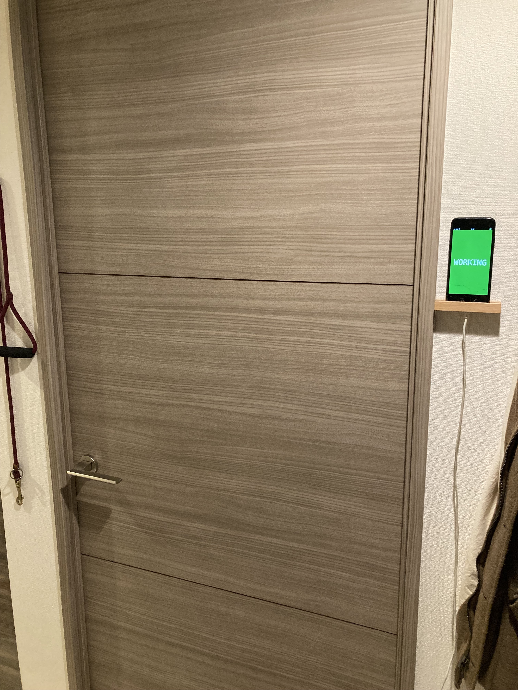
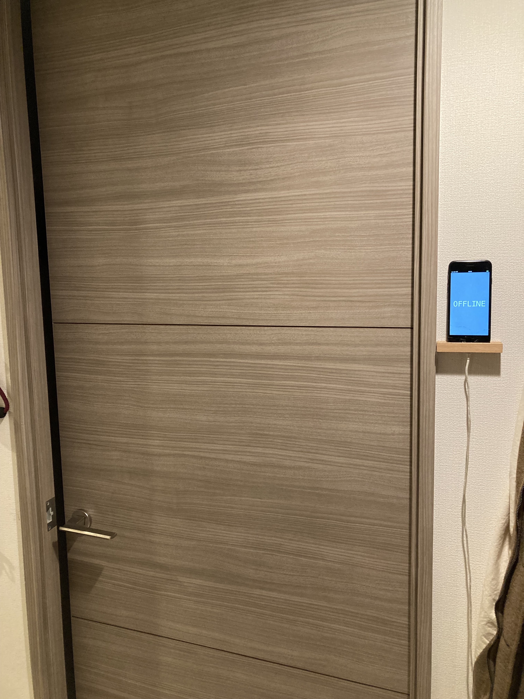
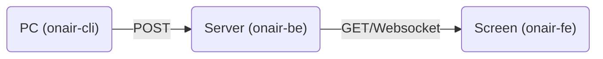

# onair

The system for remote workers to prevent their family members from interrupting conference calls. The system is designed to automatically detect conference calls on workers' PC, and let their family members know by changing the color on the screen right next to the door.

For example, when you're on conference calls, the system shows the red screen:



when you're working (PC is turned on) but not in conference calls, shows the green screen:



when you're not working (PC is turned off), shows the gray screen:



Currently, the implementation supports zoom conference and slack huddle on macbook catlina (i.e. author's PC).

## Design

- `onair-cli`: Client-side agent that monitors conference call processes and push the status to the web service (`onair-be`).
- `onair-be`: The backend part of the web service that receives the updates from `onair-cli` then publishes the status to screens.
- `onair-fe`: The frontend part of the web service that shows colored screen that indicates the current status.



## Run

This will run the web service.

```sh
make
```

## Build

This will build the web service binary.

```sh
make release
```
